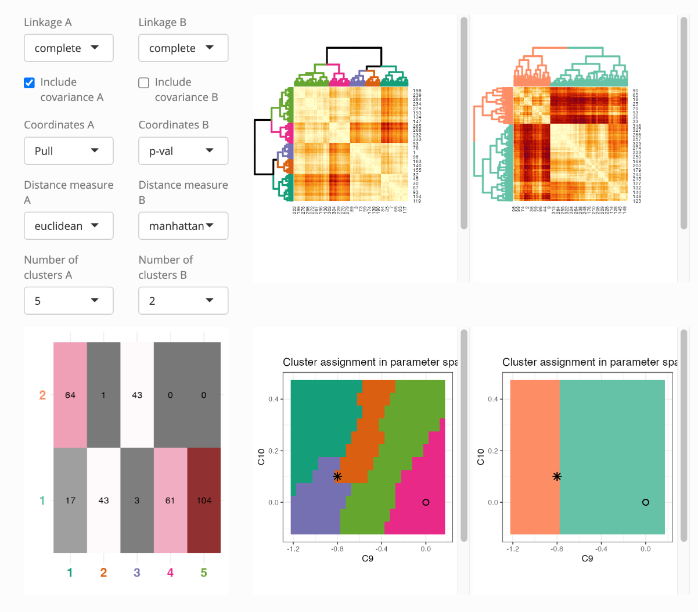

# GSOC-pandemonium

## Easy Task

Instillation and running of the pandemonium app was done with this code.

```         
devtools::install_github("uschiLaa/pandemonium")
library(pandemonium)
pandemonium(b_anomaly$pred, b_anomaly$covInv, b_anomaly$wc, b_anomaly$exp)
```

Within the app the following settings used to compare their clustering results:

-   A. Linkage - complete, include covariance - true, coordinates - pull, distance - euclidean, clusters - 5

-   B. Linkage - complete, include covariance - false, coordinates - pval, distance - manhattan, clusters - 2

From these setting it was found that B split the clusters based on the value of c9 whereas A had much more interesting cluster assignment.



## Medium task

A grand tour and a local tour were shown side by side using `detourr` R package in a `shiny` app. The `iris` data set was used. `crosstalk` was used for linked brushing.
[visuals can be found here.](Mediumvisuals.gif)
